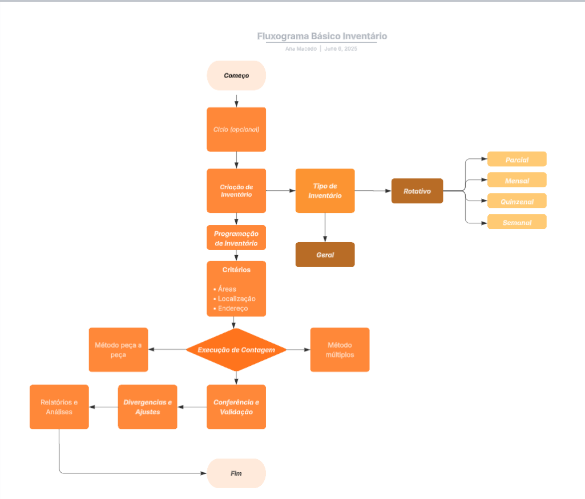

# Sistema de Inventário

## Conceito de Inventário

**Inventário** é o processo de contagem física dos itens disponíveis, tem como objetivo adequar o estoque registrado no sistema com o estoque físico, garantindo que os registros de estoque da empresa estejam constantemente atualizados. As divergências entre a contagem do estoque físico e sistêmico são denominadas **perda de inventário**, que deve ser continuamente monitorada e reduzida a fim de garantir a saúde operacional e financeira da loja.

Um estoque devidamente executado implica em diversos benefícios à operação, como:

- **Melhor controle de estoque:** a empresa possui uma visão clara das quantidades disponíveis e necessárias;
- **Redução de custos:** evita gastos com aquisições desnecessárias e perdas tanto por excesso ou por falta de produtos;
- **Precisão das informações:** evita conflitos com processos de contabilidade, fiscalizações e auditorias, além de ser essencial na tomada de decisões;
- **Melhor atendimento ao cliente:** garante a reposição de acordo com a demanda e evita atrasos de entregas;
- **Planejamento de produção:** baseia o planejamento de compras de acordo com a realidade física da loja.

### No cenário Lojas Torra



No varejo em geral, para além da finalidade de controle, o inventário também assume papel preventivo e estratégico, já que a rotatividade elevada  e riscos de perda são críticos.

Nas Lojas Torra, o processo de inventário utiliza duas metodologias de contagem:

- **Múltiplo:** utilizado quando há itens padronizados de estoque com grande volume por SKU;
- **Peça a peça:** utilizado na área de vendas, onde os produtos possuem mais variações.

---

# Programação de Inventário

A programação de inventário consiste no **agendamento do período**, tipos e métodos de contagem que serão utilizados no processo. Seu objetivo é a garantia da execução de inventário de forma organizada e eficiente, alinhada com o propósito da loja e/ou operação.

## Quem pode programar o inventário?

A programação é permitida a usuários que possuem **perfil de Inventário** habilitado no Portal Torra.

## Parâmetros da programação

Na criação de uma nova programação de inventário, o sistema permite definir parâmetros como:

- **Filiais (lojas)** ;
- **Griffe/seção** (estrutura mercadológica da loja);
- **Tipo de inventário:** Geral, Parcial, Rotativo, Mensal, Quinzenal, Semanal;
- **Datas de execução**;
- **Critérios por grupo de produtos:**
— Griffe;
— Linha;
— Tipo;
— Grupo;
— Subgrupo.

Ademais, é possível realizar a criação de programação específica por SKU, selecionando os produtos individualmente, ou por meio de upload de arquivo .txt contendo códigos dos produtos (uma linha por código, validado a partir do "enter").

> O sistema ignora códigos inválidos inseridos no arquivo. Não há a contagem ou notificação de falha ao realizar importação.
> 

## Inclusão de produtos na programação

A inclusão de produtos pode ser realizada das seguintes formas:

1. **Filtros manuais**;
2. **Inclusão individual**;
3. **Importação via arquivo .txt** (contendo apenas código de produto).

> O sistema não filtra automaticamente os produtos baseado na hierarquia (grife, grupo, tipo, etc.), esta seleção deve ser feita manualmente.
> 

## Tipos de programação existentes no sistema

### 1. Somente Negativos

O sistema possibilita a criação de um inventário somente com produtos de saldo negativo, com objetivo de validar divergências e corrigir erros do processo. A lógica da programação é considerar todos os números menores que 0, adicionado-os automaticamente ao inventário de negativos.

### 2. Estrutura Mercadológica

A estrutura mercadológica traduz-se como organização interna de produtos em uma loja a partir de categorias, subcategorias, departamentos, entre outros. A programação da estrutura permite selecionar produtos com base na sua localização mercadológica (endereçamento): griffe, linha, tipo, grupo, subgrupo, seção, etc.

### 3. Arquivo de Produtos

É uma ferramenta utilizada para gerenciar e controlar o estoque da empresa. O sistema permite o carregamento de arquivo .txt contendo códigos SKU's dos produtos a serem contados, é validado a partir de "enter" e ignora códigos incorretos sem gerar notificação de erro.

---

# Geração e Execução

O conceito de **contagem de inventário** é o processo de registro físico da **quantidade de itens existentes no estoque** para então compará-la com os dados sistêmicos. Sua importância se dá por garantir a confiabilidade de dados, evitar rupturas ou excesso de itens, identificar divergências entre estoque físico e o sistema e apoiar nas decisões estratégicas.

Procedendo a programação, é gerada uma tarefa de inventário baseada nos parâmetros definidos, e fica disponível para a equipe de loja, que fará a contagem física de produtos.

A execução é feita com a utilização de coletores de dados, onde os colaboradores realizam a leitura dos códigos de barras dos produtos e informam as suas quantidades. A contagem deve seguir o que a programação definiu e caso haja ilegibilidade de códigos os produtos são tratados com o apoio da equipe de Prevenção de Perdas.

### Endereços Duplicados

Durante o processo de cadastro ou leitura de endereços podem ocorrer endereços duplicados, quando o mesmo código de localização é registrado mais de uma vez no inventário. Esta divergência pode implicar em erros de contagem, confusão na associação de produtos ao local correto e impactos nos relatórios de inventário. Para evitar esta situação as boas práticas envolvem validar os endereços a partir da API antes de registrar, realizar a criação em lote com uma verificação automática de duplicidades e notificações sistêmicas quando há tentativa de registrar um endereço repetido.

### Histograma

O **histograma** é uma representação que demonstra a frequência dos dados em intervalos. Seu uso pode ser utilizado para visualizar a distribuição de contagens por produto, área ou endereço, identificar padrões e avaliar a qualidade da execução de contagem.

---

# Conferência e Validação

Após a conclusão da contagem e o envio dos dados ao sistema de retaguarda, ocorre a conferência e validação, onde o sistema compara valores físicos contados com saldos registrados no estoque sistêmico. O objetivo desse processo é assegurar que apenas dados corretos sigam para a etapa de ajuste.

---

# Divergência e Ajustes

Nesta etapa, aqueles produtos que apresentaram divergência entre contagem física e sistêmica são analisados. De acordo com as divergências, há a tomada de decisão entre:

- **Corrigir** manualmente o estoque no sistema;
- **Investigar** na loja ou com a equipe de Prevenção de Perdas a razão da falha;
- **Ajustar** automaticamente conforme regras da empresa.

Para que existam os ajustes é necessário que o usuário seja autorizado por um superior (geralmente da equipe de Prevenção de Perdas) e que haja a ponderação da criticidade do produto e histórico.

---

# Relatórios e Análises

O último processo se trata do sistema gerar **relatórios e gráficos** baseados nas informações do inventário. O objetivo dos relatórios é facilitar o acompanhamento e tomadas de decisões estratégicas pela liderança.
Os indicadores mais comuns são:

- Lojas que já executaram o inventário;
- Quantidade de divergências detectadas;
- Quantidade de ajustes realizados;
- Comparativos.

Analisar estes dados clarificam a identificação de padrões, áreas críticas e planos de melhorias no controle de estoque.

---

# Mapeamento da API

## Quais são as entradas e saídas?

### **— Áreas**

`[GET] /Inventario/v1/Area`**Entrada**:

- `Page`: número da página que deseja consultar (ex: `1`)
- `Limit`: quantidade de registros por página (ex: `10`)
- `OrderBy`: campo para ordenar os resultados (ex: `nome`)

**Saída:**
Lista de áreas contendo:
`id`, `codigo_inventario`, `nome`, `criado_por`, `criado_em`, `alterado_por`, `alterado_em`

```
[POST] /Inventario/v1/Areas
```

**Entrada:**


**Saída:**
Objeto da área criada.

```
[PUT] /Inventario/v1/Areas/{id}
```

**Entrada**:


**Saída:**
Área atualizada.

`[GET] /Inventario/v1/Areas/{id}`**Entrada**: `id`

**Saída:**
Detalhes da área (`id`, `nome`, `codigo_inventario`, `criado_por`, `criado_em`, `alterado_em`, `alterado_por`, `alterado_em`).

`[DELETE] /Inventario/v1/Areas/{id}`**Entrada**:
`id`

**Saída:**
Confirmação da exclusão: "Área removida com sucesso."

---

### — Catálogos

`[GET] /Inventario/v1/Catalogos/inventario/metodo-contagem [GET] /Inventario/v1/Catalogos/inventario/status[GET] /Inventario/v1/Catalogos/inventario/tipo[GET] /Inventario/v1/Catalogos/inventario/tipo-contagem[GET] /Inventario/v1/Catalogos/programação/tipo`

Retorna os métodos possíveis de contagem no inventário.

**Entrada**:

- `Page`: número da página que deseja consultar (ex: `1`)
- `Limit`: quantidade de registros por página (ex: `10`)
- `OrderBy`: campo para ordenar os resultados (ex: `nome`)
- `Desc`: ordenação decrescente

**Saída:**


Todos os endpoints de catálogo retornam uma lista paginada contendo `id`, `nome`, `codigo_inventario`, `criado_por`, `criado_em`, `alterado_em`, `alterado_por e` alterado_em`.

---

### — Ciclos

`[GET] /Inventario/v1/Ciclos`
Lista todos os ciclos do inventário com filtros opcionais.

**Entrada**:

- `Page`: número da página que deseja consultar (ex: `1`)
- `Limit`: quantidade de registros por página (ex: `10`)
- `OrderBy`: campo para ordenar os resultados (ex: `nome`)
- `Desc`: ordenação decrescente

`[POST] /Inventario/v1/Ciclos`
Cria um novo ciclo de inventário.

**Entrada:**


`[PUT] /Inventario/v1/Ciclos`
Atualiza um ciclo de inventário existente.

**Entrada**:


`[GET] /Inventario/v1/Ciclos/{id}`
Obtém os detalhes de um ciclo de inventário pelo ID.

**Entrada**:
`id`

`[DELETE] /Inventario/v1/Ciclos/{id}`
Remove um ciclo de inventário pelo ID.

**Entrada**:
`id`

**Saída:**


Todos os endpoints de ciclos retornam uma lista paginada contendo `id`, `nome`, `previsao_inicio`, `previsao_fim`, `observacao`, `criado_em`, `criado_por`, `alterado_por` e `alteracao_em`, exceto o DELETE que retorna uma confirmação da exclusão: "Área removida com sucesso."

---

### — Contagens

`[POST] /Inventario/v1/Contagens`

**Entrada**:
`codigo_endereco`, `codigo_contagem_tipo`, `produto`, `codigo_barra`, `quantidade`, `data_coleta`

**Saída:**`id`, `codigo_inventario`, `codigo_area`, `codigo_localizacao`, `codigo_endereco`,

`codigo_contagem_tipo`, `produto`, `codigo_barra`, `quantidade`, `data_coleta`,

`produto_origem`, `quantidade_origem`, `criado_por`, `criado_em`, `alterado_por`, `alterado_em`

`[GET] /Inventario/v1/Contagens/{id}`
Retorna a contagem de um ID específico.

**Entrada**:
`id`

**Saída:**`id`, `codigo_inventario`, `codigo_area`, `codigo_localizacao`, `codigo_endereco`,

`codigo_contagem_tipo`, `produto`, `codigo_barra`, `quantidade`, `data_coleta`,

`produto_origem`, `quantidade_origem`, `criado_por`, `criado_em`, `alterado_por`, `alterado_em`

`[DELETE] /Inventario/v1/Contagens/duplicados`
Remove um ciclo de inventário pelo id.

**Entrada**:
`codigo_endereco`, `codigo_contagem_tipo`, `produto`: código do produto`,` codigo_operador`

**Saída:**
Confirmação da exclusão: "Ciclo removido com sucesso."

---

### — Endereços

`[GET] /Inventario/v1/Enderecos`
Obtém uma lista pagianda de endereços.

**Entrada**:
`codigo_inventario`, `endereco`, `codigo_area`, `nome_area`, `codigo_localizacao`, `nome_localizacao`, `codigo_contagem_metodo`,

`OrderBy`, `Page`, `Limit`, `Desc`

**Saída:**


`[POST] /Inventario/v1/Enderecos`
Cria um novo endereço.

**Entrada**:
`codigo_inventario`, `codigo_area`, `codigo_localizacao`, `codigo_contagem_metodo`, `endereco`, `quantidade_limite`

**Saída:**
Mesmo retorno do POST.

`[PUT] /Inventario/v1/Enderecos`
Atualiza um endereço existente.

**Entrada**:
`codigo_inventario`, `codigo_area`, `codigo_localizacao`, `codigo_contagem_metodo`, `endereco`, `quantidade_limite` e `id`.

**Saída:**
Mesmo retorno do POST e GET.

`[DELETE] /Inventario/v1/Enderecos/{id}`
Remove um endereço pelo ID.

**Entrada**:
`id`

**Saída:**
Confirmação da exclusão: "Endereço removido com sucesso."

`[POST] /Inventario/v1/Enderecos/lote`
Cria um lote de endereços a partir de códigos de barras ou ranges.

**Entrada**:
`codigo_inventario`, `codigo_area`, `codigo_localizacao`, `codigo_contagem_metodo`,

`barras` (array), `ranges` (`inicio`, `fim`)

**Saída:**
Lista de endereços criados contendo
`id`, `codigo_inventario`, `codigo_area`, `codigo_localizacao`, `codigo_contagem_metodo`,

`endereco`, `quantidade_limite`, `criado_por`, `criado_em`, `alterado_por`, `alterado_em`

---

### — Inventarios

`[GET] /Inventario/v1/Inventarios`
Obtém uma lista pagianda de inventários. Permite a paginação via parâmetros query string.

**Entrada**:

`identificador`, `nome`, `codigo_filial`, `codigo_inventario_tipo`, `codigo_inventario_status`, `data_inicio`, `data_fim`, `OrderBy`, `Page`, `Limit`, `Desc`.

`[POST] /Inventario/v1/Inventarios`
Cria um novo inventário com os dados fornecidos.

**Entrada:**`codigo_filial`, `codigo_ciclo`, `nome`, `codigo_inventario_tipo`, `data_inicio`, `data_fim`, `quantidade_prevista`, `porcentagem_auditoria`, `nome_responsavel`, `griffe_produto`, `linha_produto`, `tipo_produto`, `grupo_produto`, `subgrupo_produto`, `produtos.

**Saída:**


`[PUT] /Inventario/v1/Inventarios`
Atualiza parcialmente os dados de um inventario existente.

**Entrada:**`codigo_filial`, `codigo_ciclo`, `nome`, `codigo_inventario_tipo`, `data_inicio`, `data_fim`, `quantidade_prevista`, `porcentagem_auditoria`, `nome_responsavel`, `griffe_produto`, `linha_produto`, `tipo_produto`, `grupo_produto`, `subgrupo_produto`, `produtos.

**Saída:**
O mesmo retorno do POST.

`[GET] /Inventario/v1/Inventarios/{id}`
Obtém os detalhes de um inventário específico pelo seu ID.

**Entarada:**`id`

**Saída:**


`[DELETE] /Inventarios/v1/Inventarios/{id}`
Remove um inventário pelo ID.

**Entrada:**`id`

**Saída:**
Confirmação da exclusão: "Inventário removido com sucesso."

`[GET] /Inventario/v1/Inventarios/{id}/enderecos-duplicados`
Obtém os detalhes de endereços duplicados pelo id.

**Entrada:**`id`, `OrderBy`, `Page`, `Limit` e `Desc`.

**Saída:**


`[GET] Inventario/v1/Inventario/{id}/histograma`
Obtém detalhes de um histograma pelo id.

**Entrada:**`id`, `area`, `localizacao`, `endereco`, `produto`, `OrderBy`, `Page`, `Limit`, `Desc`.

**Saída:**


`[GET] /Inventario/v1/Inventarios/{id}/status-enderecos`
Obtém detalhes destatus de endereços pelo seu ID.

**Entrada:**`id`, `area`, `localizacao`, `endereco`, `OrderBy`, `Page`, `Limit`, `Desc`.

**Saída:**


### — Localizações

`[GET] /Inventario/v1/Localizacoes`
Obtém uma lista paginada de localizações.

**Entrada:**`codigo_inventario`, `nome`, `codigo_area`, `OrderBy`, `Page`, `Limit`, `Desc`.

**Saída:**


`[POST] /Inventario/v1/Localizacoes`
Cria uma nova localização.

**Entrada:**`codigo_inventario`, `codigo_area`, `nome`.

**Saída:**


`[PUT] /Inventario/v1/Localizacoes`
Atualiza os dados de uma localização existente.

**Entrada:**`codigo_inventario`, `codigo_area`, `nome`, `id`.

**Saída:**


`[GET] /Inventario/v1/Localizacoes/{id}`
Obtém os detalhes de uma localização pelo ID.

**Entrada:**`id`

**Saída:**


`[DELETE] /Inventario/v1/Enderecos/{id}`
Remove um endereço pelo ID.

**Entrada**:
`id`

**Saída:**
Confirmação da exclusão: "Localização removida com sucesso."

---

### — Parâmetros

`[GET] /Inventario/v1/Parametros`
Retorna uma lista paginada de todos os parâmetros cadastrados.

**Entrada**:
`Page`, `Limit`, `OrderBy`, `Desc`.

**Saída:**


`[PUT] /Inventario/v1/Parametros` 
Altera um lote de valores a partir de parâmetro.

**Entrada**:
`id`, `valor`.

**Saída:**


---

### — Programações

`[GET] /Inventario/v1/Progamacoes`
Obtém uma lista paginada de programações. Permite a paginação via parâmetros query string.

**Entrada**:
`Page`, `Limit`, `OrderBy`, `Desc`.

**Saída:**


`[POST] /Inventario/v1/Progamacoes`
Cria uma nova programação com os dados fornecidos.

**Entrada**:
`codigo_ciclo`, `codigo_programacao_tipo`, `nome`, `data_inicio`, `data_fim`, `dia_semana`, `griffe_semana`, `linha_produto`, `filiais` e `produtos`.

**Saída:**


`[PUT] /Inventario/v1/Progamacoes`
Atualiza parcialmente os dados de uma programação existente.

**Entrada**:
`codigo_ciclo`, `codigo_programacao_tipo`, `nome`,`data_inicio`, `data_fim`, `dia_semana`, `griffe_semana`, `linha_produto`, `tipo_produto`, `grupo_produto`, `subgrupo_produto`, `filiais` e `produtos`.

**Saída:**


`[GET] /Inventario/v1/Progamacoes/{id}` 
Obtém os detalhes de uma programação específica pelo seu ID.

**Entrada**:
`id`

**Saída:**


`[DELETE] /Inventario/v1/Progamacoes/{id}`
Remove uma programação pelo seu ID.

**Entrada**:
`id`

**Saída:**
Confirmação da exclusão: "Programação removida com sucesso."

---

## Integração com outros sistemas

Para manter a sincronia dos dados de estoque automáticos há integrações entre sistemas. Atualmente, o que integram ao sistema de inventário é:

- **Coletor de dados**: utilizado para realizar a contagem física ds produtos;
- **API de Admin**: realiza a autenticação dos usuários que acessam o sistema de inventário;
- **Plataform Integration (LINX)**: barramento de integração que serve como ponte entre inventário e outros sistemas.

---